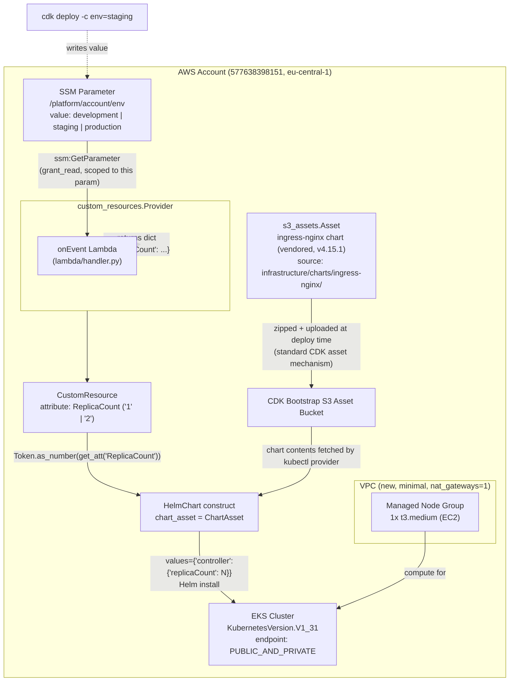

# Design Document: EKS Ingress Replica Config

## Overview

This feature provisions an Amazon EKS cluster via CDK (Python) and installs the `ingress-nginx` Helm chart into it, where the chart's `controller.replicaCount` value is derived at deploy time from an environment name stored in SSM Parameter Store (`/platform/account/env`). A Lambda function, invoked through a CDK Custom Resource, reads the SSM parameter via `boto3` and returns a single string attribute `ReplicaCount` ("1" for `development`, "2" for `staging`/`production`). The CDK stack converts that attribute to a number using `Token.as_number` and feeds it into the Helm chart's values, so the replica count is resolved entirely within CloudFormation's deploy-time token resolution, with no out-of-band scripting.

The repository is split into two self-contained, parallel-agent-friendly top-level folders: `lambda/` (the Lambda handler and its own pytest suite) and `infrastructure/` (the CDK app, stack, and its own dependencies). The only coupling between them is a relative filesystem path (`lambda_.Code.from_asset("../lambda")`) and the `ReplicaCount` attribute contract described below — no shared source files.

This is a real, deployable stack targeting a personal AWS account (577638398151, eu-central-1), sized for cost-consciousness (single NAT gateway, single t3.medium node) rather than production HA.

## Architecture



**Data flow (mirrors and expands the reference diagram):**
1. CDK context param `env` (default `development`) is written by the stack into the SSM parameter `/platform/account/env` as a stack-owned resource.
2. The Provider-framework Lambda (`lambda/handler.py`) runs on Custom Resource create/update, calls `ssm:GetParameter` on that exact parameter.
3. The Lambda returns `{"ReplicaCount": "1"}` or `{"ReplicaCount": "2"}` depending on the environment value; if the parameter is missing, `ParameterNotFound` propagates uncaught and the Provider fails the Custom Resource.
4. The CDK stack reads `custom_resource.get_att("ReplicaCount")`, converts it with `Token.as_number(...)`, and passes it as `values={"controller": {"replicaCount": <N>}}` into the `HelmChart` construct.
5. The Helm chart source is a local vendored asset: the extracted chart directory `infrastructure/charts/ingress-nginx/` is zipped and uploaded to the CDK bootstrap S3 asset bucket at deploy time via the standard CDK asset mechanism (`aws_cdk.aws_s3_assets.Asset`), rather than fetched live from `kubernetes.github.io` at deploy time. This removes the runtime dependency on the public Helm chart repository being reachable; deploy still requires AWS API/S3 access, which is unavoidable for any CDK deploy.
6. The `HelmChart` construct installs `ingress-nginx` into the EKS cluster (sourced from that asset) with that replica count, backed by the managed EC2 node group inside the new VPC.

## Components and Interfaces

### Component 1: Networking (VPC)

**Purpose**: Minimal, cost-capped network for the cluster.

**CDK construct**: `aws_cdk.aws_ec2.Vpc`

**Configuration**:
- New VPC (not imported/default)
- `nat_gateways=1` (single NAT to cap cost — deliberate, not HA)
- Default subnet configuration (public + private) sufficient for EKS managed node groups

### Component 2: EKS Cluster + Managed Node Group

**Purpose**: Runs the ingress-nginx workload.

**CDK construct**: `aws_cdk.aws_eks.Cluster` (original `aws_eks` module, **not** `aws_eks_v2`)

**Configuration**:
- `version=eks.KubernetesVersion.V1_31` (pinned explicitly)
- `kubectl_layer=KubectlV31Layer(...)` (from `aws_cdk.lambda_layer_kubectl_v31`)
- `endpoint_access=eks.EndpointAccess.PUBLIC_AND_PRIVATE` (CDK default; needed for kubectl from a personal machine, no VPN/bastion)
- `vpc=<the VPC above>`
- Managed node group added via `cluster.add_nodegroup_capacity(...)`:
  - `instance_types=[ec2.InstanceType("t3.medium")]`
  - `min_size=1, max_size=1, desired_size=1`

**Responsibilities**:
- Hosts the ingress-nginx Helm release
- Provides the kubectl provider used by the `HelmChart` construct under the hood

### Component 3: SSM Parameter

**Purpose**: Single source of truth for the account environment name; always present whenever the stack is deployed.

**CDK construct**: `aws_cdk.aws_ssm.StringParameter`

**Configuration**:
```pascal
parameter_name = "/platform/account/env"
string_value = scope.node.try_get_context("env") OR "development"
```
- Owned and always created by the stack (no conditional/optional branch — the stack always writes this resource).
- Allowed values in practice: `development`, `staging`, `production` (not enforced by an `allowed_values` constraint per the assignment wording, but documented as the contract).

### Component 4: Lambda Handler (in `lambda/`)

**Purpose**: Pure function that maps the SSM environment value to a replica count string.

**Interface**:
```pascal
FUNCTION on_event(event: Dict, context: Any) -> Dict[str, str]
```

**Responsibilities**:
- Read `/platform/account/env` via `boto3.client("ssm").get_parameter(...)`
- Map value -> `ReplicaCount` string
- Let `ParameterNotFound` (and any other boto3 error) propagate uncaught

**Runtime deps**: none beyond the Lambda-preinstalled `boto3` (documented in `requirements.txt`, likely empty).

### Component 5: CustomResource / Provider (in `infrastructure/`)

**Purpose**: Wraps the Lambda in CDK's `custom_resources.Provider` framework so CDK/CloudFormation handles all response signaling; exposes the `ReplicaCount` attribute to the rest of the stack.

**CDK constructs**:
- `aws_cdk.aws_lambda.Function` — the on-event handler, code from `lambda_.Code.from_asset("../lambda")`
- `aws_cdk.custom_resources.Provider(on_event_handler=<that function>)`
- `aws_cdk.CustomResource(service_token=provider.service_token)`

**Responsibilities**:
- No hand-rolled CFN response PUT logic — Provider handles it
- Exposes `get_att("ReplicaCount")` for downstream consumption

### Component 6: Helm Chart Install

**Purpose**: Installs ingress-nginx with the derived replica count, from a vendored (locally checked-in) chart rather than a live fetch from the public Helm chart repository.

**Vendoring step (one-time, manual, not performed by CDK at deploy time)**:
```bash
helm pull ingress-nginx --repo https://kubernetes.github.io/ingress-nginx --version 4.15.1 --untar
# extracted chart directory is committed to the repo at:
#   infrastructure/charts/ingress-nginx/
```
This is a setup-time action performed once (and again whenever the pinned version is deliberately bumped); it is not part of the CDK deploy flow.

**CDK construct**: `aws_cdk.aws_eks.HelmChart` (or `cluster.add_helm_chart(...)`)

**Configuration**:
```pascal
chart_asset = s3_assets.Asset(scope, "IngressNginxChartAsset", path = "./charts/ingress-nginx")
values = { "controller": { "replicaCount": Token.as_number(custom_resource.get_att("ReplicaCount")) } }
```
- `chart_asset` (an `aws_cdk.aws_s3_assets.Asset`) is used instead of `chart` + `repository` + `version` — `HelmChartProps` requires exactly one of `chart` or `chart_asset`, never both. CDK zips the local `infrastructure/charts/ingress-nginx/` directory and uploads it to the CDK bootstrap S3 asset bucket as part of the normal asset publishing step of `cdk deploy`.
- Not wired into any other cluster resource, per assignment scope.

## Data Models

### CustomResource Attribute Contract

This is the schema that both `lambda/` and `infrastructure/` code against, and is the only real coupling between the two folders.

```pascal
STRUCTURE OnEventResponse
  ReplicaCount: String   -- "1" | "2", ALWAYS a string (CFN GetAtt constraint)
END STRUCTURE
```

**Mapping rule** (enforced in the Lambda, documented here as the shared contract):

| SSM `/platform/account/env` value | `ReplicaCount` |
|---|---|
| `development` | `"1"` |
| `staging` | `"2"` |
| `production` | `"2"` |
| (parameter missing) | N/A — exception propagates, Custom Resource fails |

**Consumption side (CDK)**:
```pascal
replica_count_token: Number = Token.as_number(custom_resource.get_att("ReplicaCount"))
```
This sidesteps CloudFormation's `Fn::GetAtt` string-only limitation without needing to parse a JSON blob — the attribute is a single scalar, and `Token.as_number` defers the string->number coercion to deploy time.

## Algorithmic Pseudocode

### Lambda on_event Handler

```pascal
FUNCTION on_event(event, context) -> Dict[String, String]
INPUT: event (CustomResource lifecycle event dict; RequestType is Create/Update/Delete)
OUTPUT: Dict with key "ReplicaCount" mapped to "1" or "2"

PRECONDITIONS:
  - IAM role attached to this Lambda has ssm:GetParameter on
    arn:aws:ssm:<region>:<account>:parameter/platform/account/env (exactly, via grant_read)

POSTCONDITIONS:
  - On success: return value is {"ReplicaCount": "1"} or {"ReplicaCount": "2"}
  - On ParameterNotFound (or any other ssm client error): exception propagates uncaught;
    Provider framework marks the CustomResource operation FAILED (no silent default)

BEGIN
  ssm ← boto3.client("ssm")

  // No try/except around this call: ParameterNotFound MUST propagate
  response ← ssm.get_parameter(Name = "/platform/account/env")
  env_value ← response["Parameter"]["Value"]

  IF env_value = "development" THEN
    replica_count ← "1"
  ELSE IF env_value IN {"staging", "production"} THEN
    replica_count ← "2"
  ELSE
    // Unknown value: treat conservatively as multi-replica default,
    // OR raise — documented choice: raise ValueError to fail loudly
    RAISE ValueError("Unexpected environment value: " + env_value)
  END IF

  RETURN {"ReplicaCount": replica_count}
END
```

**Loop Invariants**: N/A (no loops; single linear branch).

### CDK Stack Assembly (infrastructure/stacks/eks_stack.py)

```pascal
ALGORITHM build_stack(scope, construct_id, context_env_default = "development")
BEGIN
  env_name ← scope.node.try_get_context("env") OR context_env_default

  vpc ← ec2.Vpc(scope, "Vpc", nat_gateways = 1)

  ssm_param ← ssm.StringParameter(scope, "AccountEnvParam",
                  parameter_name = "/platform/account/env",
                  string_value = env_name)

  cluster ← eks.Cluster(scope, "Cluster",
                  version = eks.KubernetesVersion.V1_31,
                  kubectl_layer = KubectlV31Layer(scope, "KubectlLayer"),
                  endpoint_access = eks.EndpointAccess.PUBLIC_AND_PRIVATE,
                  vpc = vpc)

  cluster.add_nodegroup_capacity("NodeGroup",
                  instance_types = [ec2.InstanceType("t3.medium")],
                  min_size = 1, max_size = 1, desired_size = 1)

  handler ← lambda_.Function(scope, "ReplicaCountHandler",
                  runtime = lambda_.Runtime.PYTHON_3_12,
                  handler = "handler.on_event",
                  code = lambda_.Code.from_asset("../lambda"))

  ssm_param.grant_read(handler)   -- scoped to exactly this parameter, least privilege

  provider ← cr.Provider(scope, "ReplicaCountProvider", on_event_handler = handler)

  custom_resource ← CustomResource(scope, "ReplicaCountResource",
                  service_token = provider.service_token)
  custom_resource.node.add_dependency(ssm_param)   -- ensure param exists before read

  replica_count ← Token.as_number(custom_resource.get_att("ReplicaCount"))

  chart_asset ← s3_assets.Asset(scope, "IngressNginxChartAsset",
                  path = "./charts/ingress-nginx")   -- relative to infrastructure/stacks/eks_stack.py

  helm ← cluster.add_helm_chart("IngressNginx",
                  chart_asset = chart_asset,
                  values = { "controller": { "replicaCount": replica_count } })
END
```

**Preconditions**: CDK context `env` is either unset (defaults to `development`) or one of `development`/`staging`/`production`.

**Postconditions**: Stack synthesizes a VPC, EKS cluster with one t3.medium node, an always-present SSM parameter, a Provider-backed Custom Resource exposing `ReplicaCount`, and a Helm release (sourced from the vendored chart asset, not a live repo fetch) whose `controller.replicaCount` value is that resolved number.

## Key Functions with Formal Specifications

### `on_event(event, context) -> dict`

```python
def on_event(event: dict, context) -> dict:
    ...
```

**Preconditions**:
- `event` is a dict (Provider framework passes lifecycle info; unused by this pure mapping logic beyond triggering the call)
- Lambda execution role has `ssm:GetParameter` on `/platform/account/env`

**Postconditions**:
- Returns `{"ReplicaCount": "1"}` when SSM value is `development`
- Returns `{"ReplicaCount": "2"}` when SSM value is `staging` or `production`
- Raises (does not catch) `ssm.exceptions.ParameterNotFound` when the parameter does not exist
- No side effects; does not mutate `event`

**Loop Invariants**: N/A

### IAM Grant (infrastructure side)

```pascal
ssm_param.grant_read(handler)
```

**Postcondition**: Produces an IAM policy statement equivalent to:
```json
{
  "Effect": "Allow",
  "Action": ["ssm:GetParameter"],
  "Resource": "arn:aws:ssm:eu-central-1:577638398151:parameter/platform/account/env"
}
```
attached to the Lambda's execution role — scoped to exactly one resource ARN, no wildcards.

## Example Usage

```bash
# Deploy with default env (development -> replicaCount 1)
cd infrastructure
cdk deploy

# Deploy explicitly as staging -> replicaCount 2
cdk deploy -c env=staging

# Deploy explicitly as production -> replicaCount 2
cdk deploy -c env=production
```

```python
# lambda/handler.py usage shape (Provider framework calls this directly)
def on_event(event, context):
    ssm = boto3.client("ssm")
    value = ssm.get_parameter(Name="/platform/account/env")["Parameter"]["Value"]
    if value == "development":
        return {"ReplicaCount": "1"}
    if value in ("staging", "production"):
        return {"ReplicaCount": "2"}
    raise ValueError(f"Unexpected environment value: {value}")
```

## Correctness Properties

### Property 1: SSM Parameter Always Exists

∀ deployments: the SSM parameter `/platform/account/env` exists as a stack resource (never optional/missing while the stack exists).

**Validates: Requirements 2.1**

### Property 2: Development Maps to Replica Count 1

∀ `env` ∈ {`development`}: Lambda returns `ReplicaCount = "1"`.

**Validates: Requirements 3.2**

### Property 3: Staging and Production Map to Replica Count 2

∀ `env` ∈ {`staging`, `production`}: Lambda returns `ReplicaCount = "2"`.

**Validates: Requirements 3.3, 3.4**

### Property 4: Missing Parameter Fails Loudly, Never Defaults

If the SSM parameter is deleted out-of-band before a Custom Resource create/update runs, the Lambda call raises `ParameterNotFound` and no `ReplicaCount` value is returned — the Custom Resource operation fails, it does not silently default.

**Validates: Requirements 3.5**

### Property 5: Helm Replica Count Matches Lambda Output

The Helm chart's `controller.replicaCount` numeric value passed to Kubernetes always equals the numeric coercion of the Lambda's `ReplicaCount` string for the environment active at deploy time. This holds regardless of chart source (vendored `chart_asset` vs. a live `chart`/`repository` fetch) — the property concerns the `replicaCount` value, not where the chart itself comes from.

**Validates: Requirements 6.2, 6.4, 6.5**

### Property 6: IAM Grant Scoped to Exactly One Resource ARN

The IAM policy granted to the Lambda's execution role authorizes `ssm:GetParameter` on exactly one resource ARN (`.../parameter/platform/account/env`) — never a wildcard path.

**Validates: Requirements 5.1, 5.2**

## Error Handling

### Error Scenario 1: SSM parameter missing at Custom Resource invocation

**Condition**: `/platform/account/env` deleted out-of-band between stack creation and a Custom Resource create/update event.
**Response**: `ssm.get_parameter` raises `ParameterNotFound`; the Lambda does not catch it; the Provider framework marks the CloudFormation Custom Resource event as `FAILED` with the exception message.
**Recovery**: Operator re-creates the parameter (or re-deploys the stack, which always writes it) and retries the CloudFormation operation.

### Error Scenario 2: Unexpected SSM parameter value

**Condition**: Parameter value is something other than `development`/`staging`/`production` (e.g. typo via manual SSM edit).
**Response**: Lambda raises `ValueError` with the offending value in the message; Provider marks the Custom Resource `FAILED`.
**Recovery**: Operator corrects the parameter value (or re-deploys stack with correct `-c env=...`) and retries.

### Error Scenario 3: IAM permission denied

**Condition**: Lambda execution role somehow lacks `ssm:GetParameter` on the parameter (e.g. manual role edit).
**Response**: boto3 raises `ClientError` (AccessDeniedException); propagates uncaught; Provider marks Custom Resource `FAILED`.
**Recovery**: Re-deploy the stack so `grant_read()` re-applies the correct policy statement.

## Testing Strategy

**Scope**: pytest coverage applies only to `lambda/` (per assignment: "unit tests... only for the Python code used in the Lambda function"). No pytest coverage is written for the CDK/`infrastructure/` code.

### Unit Testing Approach

Located in `lambda/tests/`. Uses `moto`'s `mock_aws` to stand up a real (mocked) SSM backend and calls the actual `boto3` `ssm.put_parameter` / the handler's `ssm.get_parameter` path — not a hand-mocked stub of `boto3`.

**Test case list**:

| Test | Setup | Call | Expected |
|---|---|---|---|
| `test_development_returns_replica_count_1` | `moto` `mock_aws`, `put_parameter(Name="/platform/account/env", Value="development", Type="String")` | `on_event({}, None)` | `{"ReplicaCount": "1"}` |
| `test_staging_returns_replica_count_2` | put_parameter value `"staging"` | `on_event({}, None)` | `{"ReplicaCount": "2"}` |
| `test_production_returns_replica_count_2` | put_parameter value `"production"` | `on_event({}, None)` | `{"ReplicaCount": "2"}` |
| `test_missing_parameter_raises` | `mock_aws` active, parameter never created | `on_event({}, None)` | raises `ssm.exceptions.ParameterNotFound` (assert via `pytest.raises`) |

**moto usage pattern**:
```python
import boto3
import pytest
from moto import mock_aws
from handler import on_event

@mock_aws
def test_development_returns_replica_count_1():
    ssm = boto3.client("ssm", region_name="eu-central-1")
    ssm.put_parameter(
        Name="/platform/account/env",
        Value="development",
        Type="String",
    )
    result = on_event({}, None)
    assert result == {"ReplicaCount": "1"}

@mock_aws
def test_missing_parameter_raises():
    with pytest.raises(Exception) as exc_info:
        on_event({}, None)
    assert "ParameterNotFound" in type(exc_info.value).__name__ or \
           "ParameterNotFound" in str(exc_info.value)
```

**Coverage target**: 100% line coverage of `lambda/handler.py`, measured via `pytest --cov=handler --cov-report=term-missing` (config in `lambda/requirements-dev.txt`: `pytest`, `pytest-cov`, `moto`).

### Property-Based Testing Approach

Not used for this feature — the mapping logic is a small, fully enumerable finite-input function (3 known values + error path), so example-based tests give complete coverage without the overhead of a property library.

### Integration Testing Approach

Out of scope per assignment wording; real end-to-end verification is a manual `cdk deploy` against the personal AWS account (577638398151, eu-central-1), not an automated integration test.

## Performance Considerations

Not applicable at this scale (single Lambda invocation per stack create/update, single small node). No performance tuning required.

## Security Considerations

- Lambda IAM role scoped to `ssm:GetParameter` on exactly one parameter ARN via `grant_read()` — no wildcard SSM access.
- EKS endpoint access is `PUBLIC_AND_PRIVATE` (not fully private) because this is a personal account without VPN/bastion; this is a deliberate, documented tradeoff, not an oversight. No additional CIDR restriction is configured in this design; tightening `public_access_cidrs` is a possible follow-up but out of scope for this assignment.
- No secrets are stored in the SSM parameter (plain environment name string); `StringParameter`, not `SecureString`, is appropriate here.
- Vendoring the ingress-nginx chart into `infrastructure/charts/ingress-nginx/` removes the deploy-time dependency on `kubernetes.github.io` being reachable, but it also means the chart no longer updates itself: bumping the pinned version requires deliberately re-running `helm pull ingress-nginx --repo https://kubernetes.github.io/ingress-nginx --version <new-version> --untar` and committing the resulting chart content. There is no mechanism by which the deployed chart can silently drift to a newer or different version — every change is an explicit, reviewable commit.

## Dependencies

**`lambda/`**:
- Runtime: `boto3` (preinstalled in Lambda runtime; `requirements.txt` documents this, likely empty)
- Dev/test (`requirements-dev.txt`): `pytest`, `pytest-cov`, `moto`

**`infrastructure/`**:
- `aws-cdk-lib` (includes `aws_cdk.aws_eks`, `aws_cdk.aws_ec2`, `aws_cdk.aws_ssm`, `aws_cdk.aws_lambda`, `aws_cdk.custom_resources`, `aws_cdk.aws_s3_assets`)
- `aws_cdk.lambda_layer_kubectl_v31` (for `KubectlV31Layer`)
- `constructs`

## Repository Layout

```
replica-counter/
├── assignment/
│   ├── eks_assignment.md
│   └── eks_assignment.png
├── lambda/
│   ├── handler.py
│   ├── requirements.txt
│   ├── requirements-dev.txt
│   └── tests/
│       └── test_handler.py
└── infrastructure/
    ├── app.py
    ├── cdk.json
    ├── requirements.txt
    ├── charts/
    │   └── ingress-nginx/        -- vendored chart (helm pull --untar, v4.15.1, committed)
    └── stacks/
        └── eks_stack.py
```

`infrastructure/` couples to `lambda/` only via the relative path string `"../lambda"` passed to `lambda_.Code.from_asset(...)` and the `ReplicaCount` attribute contract documented above — no shared source files, so the two folders can be developed in parallel without conflicts.
