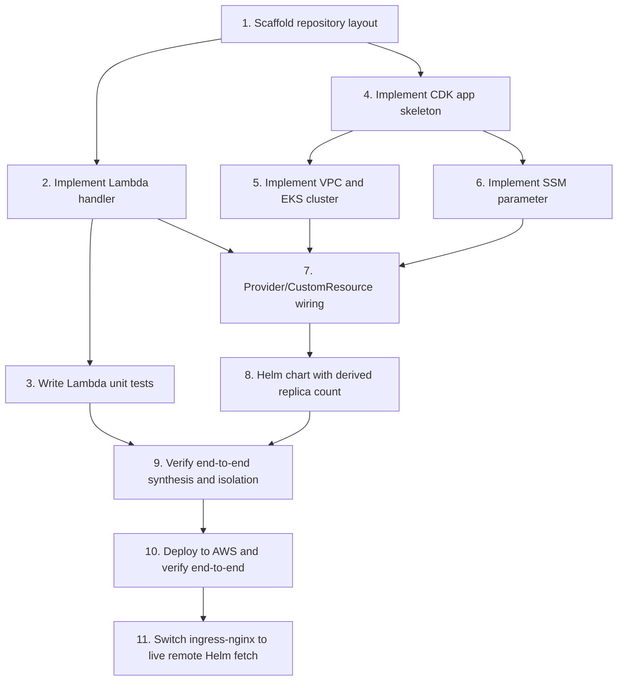

# Implementation Plan: EKS Ingress Replica Config

## Overview

This plan implements the design in `design.md`: a CDK stack that provisions a VPC and EKS cluster, reads an environment-driven SSM parameter, resolves a replica count via a custom-resource-backed Lambda, and installs the `ingress-nginx` Helm chart with that replica count. Lambda code (`lambda/`) and infrastructure code (`infrastructure/`) are kept independent and are wired together only in the Provider/CustomResource step.

## Tasks

- [x] 1. Scaffold repository layout
  - Create top-level `lambda/` and `infrastructure/` folders as described in design.md's Repository Layout section.
  - Create empty placeholders: `lambda/tests/`, `infrastructure/stacks/`.
  - _Requirements: 8.1, 8.2_

- [ ] 2. Implement Lambda handler (`lambda/`)
  - [ ] 2.1 Write `lambda/handler.py` with `on_event(event, context)`
    - Call `boto3.client("ssm").get_parameter(Name="/platform/account/env")`.
    - Map `development` -> `{"ReplicaCount": "1"}`, `staging`/`production` -> `{"ReplicaCount": "2"}`.
    - Raise `ValueError` for any other value; let `ParameterNotFound` propagate uncaught (no try/except around the get_parameter call).
    - _Requirements: 3.1, 3.2, 3.3, 3.4, 3.5, 3.6, 3.7_
  - [ ] 2.2 Write `lambda/requirements.txt` and `lambda/requirements-dev.txt`
    - `requirements.txt`: document that boto3 is preinstalled in the Lambda runtime (leave empty or add a comment).
    - `requirements-dev.txt`: pin `pytest`, `pytest-cov`, `moto` to specific versions.
    - _Requirements: 3.7_

- [ ] 3. Write Lambda unit tests with moto
  - [ ] 3.1 Write `lambda/tests/test_handler.py` covering development/staging/production/missing-parameter cases
    - Use `@mock_aws` and real `ssm.put_parameter` calls to set up state (no hand-mocked boto3 stub).
    - Assert `on_event({}, None)` returns `{"ReplicaCount": "1"}` for `development`.
    - Assert `on_event({}, None)` returns `{"ReplicaCount": "2"}` for `staging` and for `production`.
    - Assert `on_event({}, None)` raises when the parameter is absent under `mock_aws`.
    - _Requirements: 7.1, 7.3, 7.4, 7.5, 7.6, 7.7_
  - [ ] 3.2 Run `pytest --cov=handler --cov-report=term-missing` in `lambda/` and confirm 100% coverage of `handler.py`
    - Add any missing branch coverage (e.g. the unexpected-value `ValueError` path) if the report shows gaps.
    - _Requirements: 7.2, 7.8_

- [x] 4. Implement CDK app skeleton (`infrastructure/`)
  - [x] 4.1 Write `infrastructure/cdk.json` and `infrastructure/requirements.txt`
    - `requirements.txt`: pin `aws-cdk-lib`, `constructs`, `aws-cdk.lambda-layer-kubectl-v32`. All service constructs ship inside `aws-cdk-lib` in CDK v2 — no separate per-service packages needed.
    - _Requirements: none directly (supports all infra requirements)_
  - [x] 4.2 Write `infrastructure/app.py` instantiating the stack, passing through CDK context
    - _Requirements: 2.2, 2.3_
  - [x] 4.3 Vendor the `ingress-nginx` Helm chart into the repo
    - One-time, manual setup step (not part of automated build/deploy; requires the `helm` CLI installed locally as a prerequisite): run `helm pull ingress-nginx --repo https://kubernetes.github.io/ingress-nginx --version 4.15.1 --untar`.
    - Commit the resulting extracted chart directory to `infrastructure/charts/ingress-nginx/`.
    - _Requirements: 6.1, 6.3_

- [x] 5. Implement VPC and EKS cluster in the stack
  - [x] 5.1 In `infrastructure/stacks/eks_stack.py`, create the VPC with `nat_gateways=1`
    - _Requirements: 1.1_
  - [x] 5.2 Create the EKS cluster via `aws_cdk.aws_eks.Cluster` with `KubernetesVersion.V1_32`, `KubectlV32Layer`, `EndpointAccess.PUBLIC_AND_PRIVATE`, and the VPC from 5.1
    - _Requirements: 1.2, 1.3_
  - [x] 5.3 Add the managed EC2 node group (`t3.medium`, min=1/max=1/desired=1) via `cluster.add_nodegroup_capacity`
    - _Requirements: 1.4_

- [x] 6. Implement SSM parameter in the stack
  - [x] 6.1 Create the `StringParameter` `/platform/account/env`, sourcing its value from `scope.node.try_get_context("env")` defaulting to `"development"`
    - _Requirements: 2.1, 2.2, 2.3, 2.4_

- [x] 7. Implement Lambda function resource, IAM grant, and Provider/CustomResource wiring
  - [x] 7.1 Define the `aws_cdk.aws_lambda.Function` resource with `code=lambda_.Code.from_asset("../lambda")` and handler `handler.on_event`
    - _Requirements: 4.1_
  - [x] 7.2 Grant least-privilege read access via `ssm_param.grant_read(handler)`
    - _Requirements: 5.1, 5.2_
  - [x] 7.3 Wrap the function in `custom_resources.Provider` and create the `CustomResource` with `service_token=provider.service_token`
    - _Requirements: 4.2, 4.3, 4.5_
  - [x] 7.4 Add an explicit dependency from the Custom Resource (or its underlying resource) on the SSM parameter
    - _Requirements: 4.4_

- [x] 8. Implement Helm chart installation with derived replica count
  - [x] 8.1 Compute `replica_count = Token.as_number(custom_resource.get_att("ReplicaCount"))`
    - _Requirements: 6.2_
  - [x] 8.2 Install the `ingress-nginx` Helm chart from the vendored chart asset via `s3_assets.Asset(scope, "IngressNginxChartAsset", path="./charts/ingress-nginx")` and `cluster.add_helm_chart(..., chart_asset=chart_asset, values={"controller": {"replicaCount": replica_count}})`, not wired to any other resource, with no `chart`/`repository`/`version` properties set
    - _Requirements: 6.1, 6.3, 6.4, 6.5_

- [x] 9. Verify end-to-end synthesis and isolation
  - [x] 9.1 Run `cdk synth` in `infrastructure/` and confirm it succeeds without needing to run anything in `lambda/` beyond the asset files existing on disk
    - _Requirements: 8.3, 8.4_
  - [x] 9.2 Confirm `lambda/`'s pytest suite runs and passes independently of `infrastructure/` (no CDK imports in `lambda/`)
    - _Requirements: 8.3, 8.4_

- [x] 10. Deploy to AWS and verify end-to-end
  - [x] 10.1 Bootstrap the CDK environment (`cdk bootstrap`) against account 577638398151, eu-central-1, if not already bootstrapped
    - Required because the Helm chart asset upload (task 8.2) depends on the CDK bootstrap S3 asset bucket existing.
    - _Requirements: 6.1_
  - [x] 10.2 Deploy with default context (`cdk deploy` in `infrastructure/`) and verify the `development` result
    - Confirm the deploy completes successfully (no rollback/failure).
    - Verify `aws ssm get-parameter --name /platform/account/env` returns value `development`.
    - Verify via `kubectl get deployment -n <namespace>` (or `helm list` / `kubectl get pods`) that the ingress-nginx controller is running with 1 replica.
    - _Requirements: 1.1, 1.2, 1.3, 1.4, 2.1, 2.3, 6.4_
  - [x] 10.3 Redeploy with `cdk deploy -c env=staging` and verify the `staging` result
    - Confirm `aws ssm get-parameter --name /platform/account/env` now returns value `staging`.
    - Confirm the ingress-nginx controller scales to 2 replicas.
    - _Requirements: 2.2, 6.5_
  - [x] 10.4 Confirm clean Lambda execution and CloudFormation status for both deploys
    - Confirm the Lambda's CloudWatch Logs show no errors during either the `development` or `staging` deploy.
    - Confirm the CustomResource shows `CREATE_COMPLETE` (first deploy) and `UPDATE_COMPLETE` (staging redeploy) in the CloudFormation console/CLI.
    - _Requirements: 4.2, 4.4, 4.5_
  - [x] 10.5 Tear down the stack (`cdk destroy`) and confirm clean deletion
    - Run `cdk destroy` once verification is complete, to avoid ongoing cost on the personal account.
    - Confirm the stack deletes cleanly, including the EKS cluster, node group, NAT gateway, and VPC.
    - _Requirements: 1.1, 1.2, 1.4_

- [x] 11. Switch ingress-nginx from vendored chart to live remote Helm fetch
  - [x] 11.1 Remove the vendored chart from the repo
    - Delete the entire `infrastructure/charts/ingress-nginx/` directory (130+ vendored chart files) so the chart is no longer checked in.
    - Confirm nothing anywhere in the repo still references the `charts/` path after deletion, not just under `infrastructure/` (the repo-root `README.md` and `docs/` also described the vendored chart).
    - _Requirements: 6.1, 6.3_
  - [x] 11.2 Rewire the Helm chart install to a live remote fetch in `infrastructure/stacks/eks_stack.py`
    - Remove the `from aws_cdk import aws_s3_assets as s3_assets` import.
    - Remove the `IngressNginxChartAsset` `s3_assets.Asset(...)` construct.
    - Change `cluster.add_helm_chart("IngressNginx", ...)` from `chart_asset=chart_asset` to a live fetch: `chart="ingress-nginx"`, `repository="https://kubernetes.github.io/ingress-nginx"`, `version="4.15.1"`.
    - Keep `values={"controller": {"replicaCount": replica_count}}`, `release="ingress-nginx"`, `wait=True`, and the existing node-group dependency unchanged.
    - _Requirements: 6.1, 6.3, 6.4, 6.5_
  - [x] 11.3 Double-check and clean up `infrastructure/requirements.txt`
    - Confirm no separate `aws_s3_assets` package is pinned (it ships inside `aws-cdk-lib` in CDK v2, so no dependency change is expected).
    - Remove any stale reference or comment mentioning the vendored chart / `charts/` directory.
    - _Requirements: 6.1_
  - [x] 11.4 Verify synthesis with the live-fetch chart
    - Run `cdk synth` in `infrastructure/` and confirm the stack still synthesizes with the live-fetch Helm chart (`chart`/`repository`/`version`, no `chart_asset`).
    - Note: `cdk synth` does not contact the chart repository, so it proves only that the template is shaped correctly. Whether the provider Lambda can actually reach the repository is only proven by task 11.5.
    - _Requirements: 6.1, 6.4, 6.5_
  - [x] 11.5 Redeploy and verify the live remote chart installs correctly
    - Run `cdk deploy` (development) and confirm the ingress-nginx controller installs from the live remote chart with the correct replica count (1 for development).
    - Optionally redeploy with `cdk deploy -c env=staging` and confirm 2 replicas.
    - Note: this incurs real billable AWS cost (matches the task 10 cost caveat) and MUST end with `cdk destroy`.
    - Verified in account 070479953663 / eu-central-1 (not the 577638398151 named elsewhere in this spec; the live credentials point at 070479953663). `cdk deploy` reached CREATE_COMPLETE in ~926s with the `Custom::AWSCDK-EKS-HelmChart` resource succeeding under `wait=True`, which proves the provider Lambda fetched the chart over the NAT gateway. Cluster came up on Kubernetes `1.32`.
    - Development: SSM `/platform/account/env` = `development`, `ingress-nginx-controller` `spec.replicas` = 1, pod `1/1 Running`. Chart label `helm.sh/chart=ingress-nginx-4.15.1` and image `controller:v1.15.1` confirm the pinned remote chart was installed with no chart committed in the repo.
    - Staging: `cdk deploy -c env=staging` updated in ~52s, SSM = `staging`, `spec.replicas` = 2, both pods Running.
    - `cdk destroy` completed; verified zero remaining EKS clusters, NAT gateways, running instances, and non-default VPCs.
    - _Requirements: 6.1, 6.3, 6.4, 6.5_
  - [x] 11.6 Remove the vendored-chart references from `docs/agentic-workflow.md`
    - Scope is `docs/agentic-workflow.md` only. `docs/tests-results.md` and the screenshots under `docs/screenshots/` need NO change: they describe the SSM parameter, the `Custom::AWSCDK-EKS-HelmChart` resource updating, and the resulting `ingress-nginx-controller` replica/pod counts, none of which the vendored-to-live-fetch switch alters. The chart's source is never mentioned there, and the test cases and their results are unchanged.
    - Delete challenge item 4 ("Vendoring the Helm chart instead of a live fetch") from the challenges list outright, rather than rewriting it. It documents a decision that has since been reversed, so it is no longer a challenge that was overcome. Renumber the following item (EOL / version drift) from 5 to 4.
    - Fix the two stale phrases in the "Hook 2 - CDK synth/review on change" section: the design summary reads `vendored Helm chart`, and the security re-check reads `no leaked live-fetch Helm chart properties`. That second phrase is now inverted, since `chart`/`repository`/`version` are exactly what the stack should have. Reword both so the hook describes validating the pinned live remote fetch.
    - The repo-root `README.md` was already corrected separately; no further action needed there.
    - Also fixed `.kiro/hooks/cdk-synth-on-change.json`, found while doing this task and outside its original docs-only scope. That hook is the live artifact the "Hook 2" doc section describes, and it still enforced the old design: it required `KubernetesVersion.V1_31`/`KubectlV31Layer` and mandated the vendored `chart_asset` "never `chart`+`repository`+`version`", with a dedicated step to flag live-fetch properties as leakage. Left alone it would have fired on the next save of `eks_stack.py` and reported the now-correct code as a design deviation. Updated to `V1_32`/`KubectlV32Layer` and to assert the pinned live remote fetch, including flagging a missing or floating `version` as drift. Also closed a pre-existing gap in its step numbering (it skipped 4).
    - _Requirements: 6.1, 6.3_

## Notes

- **Parallel-agent folder split**: `lambda/` (tasks 2-3) and `infrastructure/` (tasks 4-6) have no code dependency on each other and can be implemented in parallel by two different engineers/agents. They converge at task 7, where the CDK stack references the Lambda code as a deployment asset.
- **Moto-based coverage**: Lambda unit tests (task 3) must use `moto`'s `@mock_aws` with real `ssm.put_parameter` calls rather than hand-mocked boto3 stubs, and must reach 100% coverage of `handler.py` (task 3.2). Any coverage gap must be closed with additional test cases, not with `# pragma: no cover` exclusions.
- **Pinned versions**: Kubernetes version `1.32` (via `KubernetesVersion.V1_32` / `KubectlV32Layer`) and `ingress-nginx` chart version `4.15.1` are fixed by the design. Do not bump either without first updating `design.md`, since the CDK layer package and chart values schema are version-coupled. The chart is pulled live from `https://kubernetes.github.io/ingress-nginx` at the pinned `version="4.15.1"`; bumping it is an explicit, reviewable change to that version string (task 11).
- **Live remote chart**: the `ingress-nginx` chart is fetched live from `https://kubernetes.github.io/ingress-nginx` at deploy time (task 11), pinned to `version="4.15.1"`, rather than vendored into `infrastructure/charts/ingress-nginx/`. The pull runs inside CDK's kubectl provider Lambda, which reaches the public repo through the VPC's existing NAT gateway (`nat_gateways=1`). Bumping the chart version is just an edit to the pinned `version` string; there is no longer a vendored chart directory to re-pull and commit.
- **Real AWS spend**: task 10 is the only task in this plan that incurs real billable AWS cost (EKS control plane, NAT gateway, EC2 node) in the personal account (577638398151, eu-central-1). It should be run last, only after tasks 1-9 (including the full Lambda test suite and `cdk synth`) pass. Always finish with `cdk destroy` (task 10.5) to avoid leaving the EKS cluster, NAT gateway, and other billable resources running.

## Task Dependency Graph



Track split:
- Engineer/agent A (lambda/): 1 -> 2 -> 3
- Engineer/agent B (infrastructure/): 1 -> 4 -> 5, 6
- Convergence: 3 and (5, 6) feed into 7 -> 8 -> 9 -> 10

```json
{
  "waves": [
    { "wave": 1, "tasks": [1] },
    { "wave": 2, "tasks": [2, 4] },
    { "wave": 3, "tasks": [3, 5, 6] },
    { "wave": 4, "tasks": [7] },
    { "wave": 5, "tasks": [8] },
    { "wave": 6, "tasks": [9] },
    { "wave": 7, "tasks": [10] },
    { "wave": 8, "tasks": [11] }
  ]
}
```
