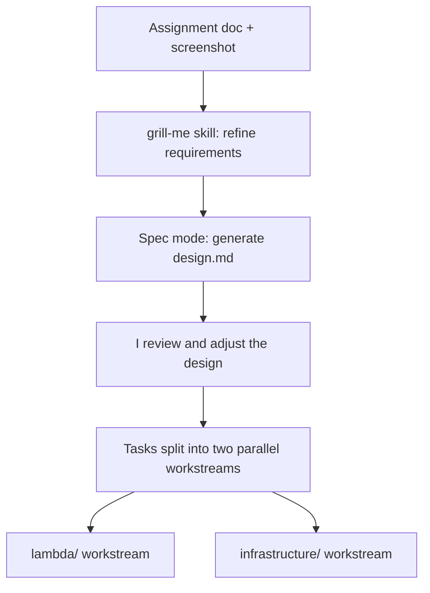
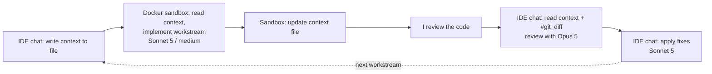
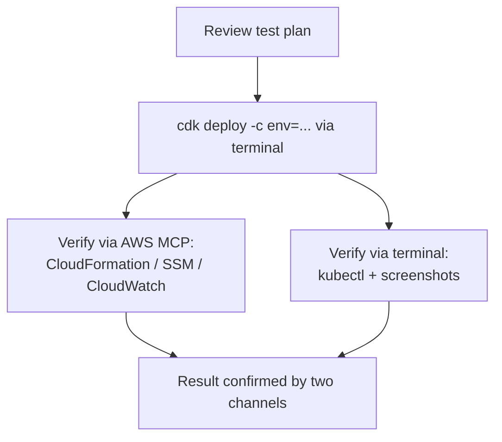

# Agentic Development Workflow

This document describes how I built the EKS ingress replica-count project
using Kiro as an agentic development environment. It focuses less on the
feature itself and more on *how I drove the agent* - the tooling I set up,
the guardrails I put in place, and the review loop I ran to keep an LLM
productive and honest across a multi-part infrastructure project.

---

## 1. Environment setup: AWS Agent Toolkit

Before writing any code, I set up the agent's capabilities so it could
reason about AWS correctly instead of guessing:

- **AWS skills** - domain skill packs (EKS/containers, CDK, Lambda,
  serverless, IAM, secrets) that the agent loads on demand so its guidance
  reflects current AWS behavior rather than stale training data.
- **Steering files** - always-on project rules. I added a
  `python-best-practices` steering file so every Python file the agent
  touched followed a consistent style, typing, and testing convention
  without me repeating myself each turn. An AWS agent-rules steering file
  also kept the agent using the AWS MCP server and documentation-first
  verification.
- **AWS MCP server** - gave the agent a sandboxed, audited path to make real
  AWS API calls (read state, verify deployments, inspect CloudWatch logs)
  and to search official AWS documentation, rather than relying on the
  terminal alone.

### Context7 power

I also enabled the **Context7 power**, which gives the agent access to
up-to-date library and framework documentation on demand. This mattered for
a CDK project where construct APIs and version-coupled packages (e.g. the
`kubectl` Lambda layer that must match the Kubernetes version) change
frequently and are easy to get subtly wrong from memory.

---

## 2. Guardrails: custom hooks

I wrote two hooks to enforce discipline automatically instead of relying on
myself (or the agent) to remember.

### Hook 1 - Lambda TDD Guard (deliberate TDD choice)

I chose **test-driven development on purpose** for the Lambda code. TDD pairs
especially well with LLMs: writing the test first pins down the exact
expected behavior as an executable contract, which keeps the model from
drifting or "implementing to a vibe." The catch is that real TDD requires the
test to exist *before* the implementation file is written - and the only
Kiro trigger that can enforce "before" is a **PreToolUse** hook on write
operations.

The naive version of that hook fires on *every* file write and would call
the LLM each time to reason about whether TDD was satisfied - a huge, mostly
wasted token cost, since the vast majority of writes are irrelevant to the
Lambda. To fix that, I backed the hook with a small **Python script**
(`tdd_guard.py`) that does the filtering deterministically, with no LLM call
at all:

- It inspects the write's target path.
- It ignores anything that isn't a Python implementation file directly under
  `lambda/` (tests, `__init__.py`, and all `infrastructure/` files pass
  straight through).
- For a real Lambda implementation file, it checks whether the matching
  `lambda/tests/test_<module>.py` already exists. If not, it exits with
  code `2` and a message that **blocks the write** and tells the agent to
  write the failing test first.

So the LLM is only ever involved when the guard actually has something to
enforce; the routine case is a cheap, instant script decision.

### Hook 2 - CDK synth/review on change

A **PostFileSave** hook scoped to `infrastructure/**/*.py` (and
`*_stack.py`/`cdk.json`) that, whenever CDK code is saved, drives the agent
to run `cdk synth`, validate the synthesized template against the settled
design (VPC/EKS/SSM/Provider-Lambda/vendored Helm chart), run `cdk diff`
against any existing deployment, and specifically re-check the security-
sensitive bits (least-privilege SSM IAM scope, no leaked live-fetch Helm
chart properties, folder isolation). This turned "did I break the design?"
into an automatic check on every infrastructure edit.

---

## 3. From assignment to design (grilling first)

I started by giving the agent the **assignment document and a screenshot**,
then invoked the **`grill-me` skill in its default mode**. Rather than
letting the agent jump straight to code, grilling made it interrogate me
about every ambiguous aspect of the task until the requirements were fully
pinned down. This front-loaded the context so the eventual design was
grounded in decisions I had actually made, not assumptions.

With that shared context established, I switched the agent into **Spec mode**
and asked it to produce the design from the grilled context. I then
**reviewed the design myself and adjusted it** to my needs. Crucially, I
asked the agent to structure the implementation tasks as **two independent
workstreams** - the **Lambda** track and the **CDK/infrastructure** track -
so they had no code dependency on each other and could be developed in
parallel if needed.

---

## 4. The per-workstream development loop

My default model was **Claude Sonnet 5 at medium effort** for implementation
work. For each workstream I ran the same loop, designed to combine an
isolated execution sandbox with a persistent, reviewable context:

1. **Capture context** - In the IDE chat, I asked the agent to write a
   summary of the current context to a file.
2. **Sandboxed implementation** - I spun up a **Docker sandbox (`docker sbx`)**
   and told that agent to read the context file and implement one workstream
   in isolation.
3. **Persist results** - When it finished, I had it **update the context
   file** so the state of the work was captured back in the repo.
4. **Human review** - I reviewed the code myself.
5. **Stronger-model review in the IDE** - Back in the IDE chat, I had the
   agent read the updated context file, then fed it the changes via the
   IDE's **`#git_diff`** feature so it knew exactly what changed. For this
   review pass I switched to **Opus 5**, which is a stronger model, and used
   the IDE chat specifically so all the context stayed in one place.
6. **Apply fixes with the default model** - Once the review produced concrete
   findings, I switched back to **Sonnet 5** and asked it to implement the
   requested changes.

I repeated this loop for **every workstream**.

The intent behind this split:

- **Sandbox for execution** keeps risky/iterative work isolated from my
  machine and the main branch.
- **Context file as the handoff medium** lets a fresh agent (in a different
  environment or model) pick up exactly where the last one left off, without
  relying on chat history that doesn't cross environments.
- **`#git_diff` for review** gives the reviewing model precise, factual input
  about what actually changed instead of a re-described summary.
- **Model choice per phase** - a capable, cost-effective model for
  implementation; a stronger model for review, where catching subtle bugs
  pays off most.

---

## 5. End-to-end testing and verification

For the deployment phase I reviewed the test plan first, then had Kiro carry
out the real `cdk deploy` runs against AWS. Results were verified through two
independent channels:

- **AWS MCP server** - to query real resource state (CloudFormation status,
  SSM parameter value, EKS cluster, and the Helm handler's CloudWatch logs)
  directly and audibly.
- **The terminal** - to run `cdk deploy -c env=...` and `kubectl` against the
  live cluster, which also produced the screenshots captured in
  [`tests-results.md`](tests-results.md).

Using both channels meant a claimed result (e.g. "staging scales to 2
replicas") was cross-checked against the actual cluster rather than trusted
from a single source.

---

## Challenges

A few non-obvious problems surfaced during development and end-to-end
deployment. The agentic loop (real deploys verified through the AWS MCP
server and terminal) is what surfaced most of them, since several only fail
at deploy time and pass every local synth/test.

1. **Custom Resource `Data` wrapper** - the Lambda returned
   `{"ReplicaCount": ...}` flat, but the CDK Provider framework only exposes
   attributes nested under a top-level `Data` key. This was silently
   accepted by the framework yet failed the first real deploy with
   *"Vendor response doesn't contain ReplicaCount attribute."* Fixed by
   returning `{"Data": {"ReplicaCount": ...}}`.

2. **Environment switch didn't re-invoke the Lambda** - the Custom Resource
   had no changing properties, so CloudFormation never sent it an `Update`;
   switching `env` updated the SSM parameter but left the replica count
   stale. Fixed by adding an `EnvironmentName` property to the resource so
   its desired state changes with the environment.

3. **Helm install racing the cluster networking** - the kubectl/Helm handler
   Lambda timed out reaching the control plane
   (*"cluster unreachable: connection timed out"*) because it ran before the
   node group networking had settled. Fixed with an explicit Helm-chart ->
   node-group dependency.

4. **Vendoring the Helm chart instead of a live fetch** - rather than
   granting the cluster internet access to pull `ingress-nginx` from the
   public Helm repo at deploy time, we vendored the chart locally
   (`helm pull --untar` into `infrastructure/charts/ingress-nginx/`) and
   installed it via a `chart_asset`, removing the deploy-time dependency on
   `kubernetes.github.io` being reachable.

5. **EOL / version drift** - CDK defaulted the node group to the now-
   unpatched AL2 AMI, and Kubernetes 1.31 had already dropped into extended
   support. Fixed by pinning the AL2023 AMI and bumping to Kubernetes 1.32.

---

## Summary of Kiro features exercised

| Capability | How I used it |
| ---------- | ------------- |
| AWS skills | On-demand, current AWS domain knowledge (EKS, CDK, Lambda, IAM) |
| Steering files | Always-on Python best-practices and AWS agent rules |
| AWS MCP server | Sandboxed, audited AWS API calls + doc search for verification |
| Context7 power | Up-to-date library/framework docs for CDK construct APIs |
| PreToolUse hook + Python script | Token-efficient TDD guard on Lambda writes |
| PostFileSave hook | Automatic `cdk synth`/design-compliance review on CDK edits |
| grill-me skill | Requirement refinement before any design work |
| Spec mode | Generating and iterating on the design and task breakdown |
| Parallel workstreams | Lambda and CDK tracks kept independent |
| Model selection | Sonnet 5 (medium) to implement, Opus 5 to review |
| Docker sandbox (`docker sbx`) | Isolated per-workstream implementation |
| `#git_diff` context | Precise change input for the review model |
