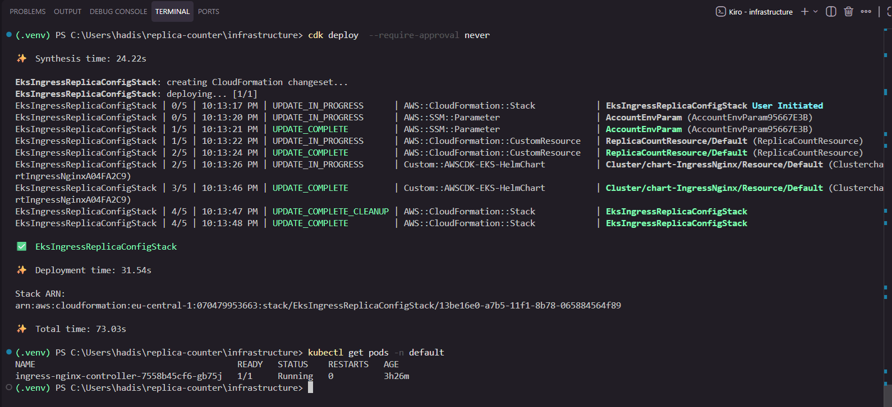
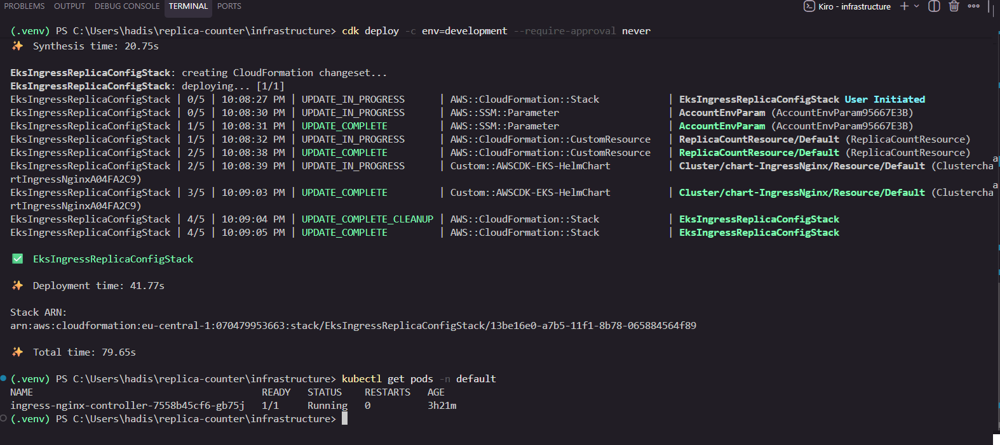
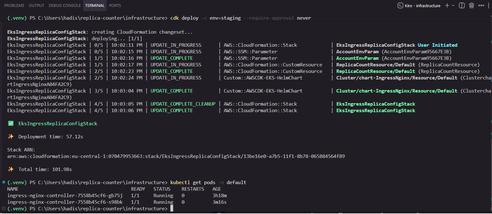
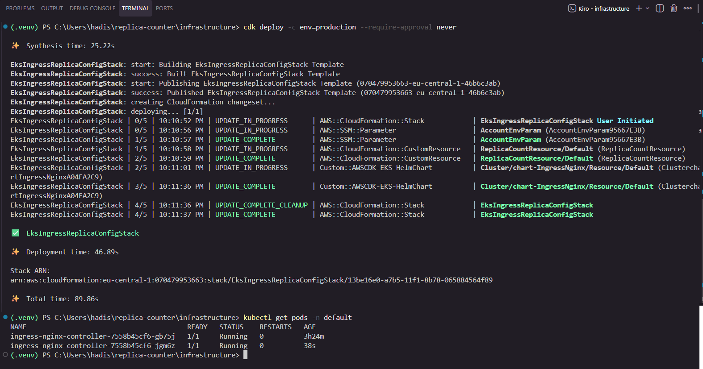
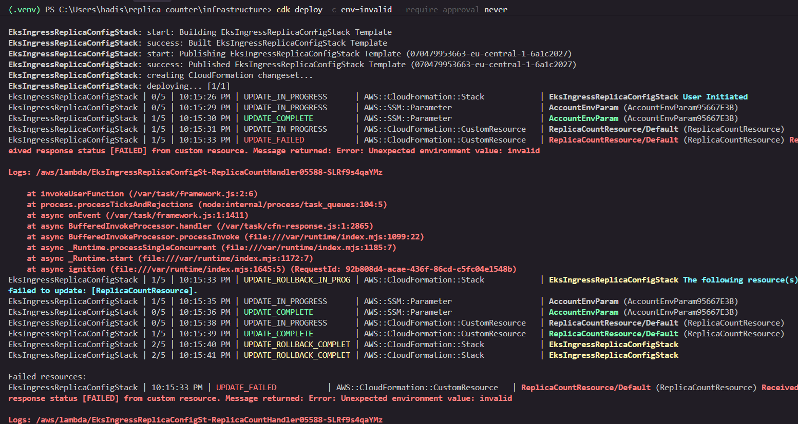

# Deployment Test Results

This document records the manual end-to-end deployment tests for the EKS
ingress replica-count stack, run against a real AWS account in region
`eu-central-1`. Each test deploys the stack with a different `env` CDK
context value and confirms that the `ingress-nginx` controller ends up with
the replica count the assignment requires:

| Environment  | Expected `controller.replicaCount` |
| ------------ | ---------------------------------- |
| `development` (or unset) | 1                      |
| `staging`    | 2                                  |
| `production` | 2                                  |

All commands are run from the `infrastructure/` folder with the Python
virtualenv activated and AWS credentials configured (`eu-central-1`). The
`--require-approval never` flag skips the interactive security-change prompt
so the deploy runs unattended.

The replica count is verified two ways: the `AWS::SSM::Parameter` and
`ReplicaCountResource` (the Lambda-backed Custom Resource) update in the
CloudFormation event stream, and `kubectl get pods -n default` shows the
resulting number of running `ingress-nginx-controller` pods.

Screenshots for each case are embedded below and stored in
[`screenshots/`](screenshots/).

> Note: the AWS account ID is redacted from this document's text, but it is
> still visible in the CloudFormation stack ARNs shown inside the
> screenshots themselves.

---

## 1. Default deploy (no context) -> 1 replica

Deploying with no `-c env=...` falls back to the stack default of
`development`.

```powershell
cdk deploy --require-approval never
kubectl get pods -n default
```

**Expected result:**

- Stack reaches `UPDATE_COMPLETE` (or `CREATE_COMPLETE` on a first deploy).
- The `Custom::AWSCDK-EKS-HelmChart` resource updates successfully.
- Exactly **1** `ingress-nginx-controller` pod is `Running` / `1/1`.

Shows the deploy completing and a single `ingress-nginx-controller-...` pod
`1/1 Running`:



---

## 2. Development deploy -> 1 replica

Explicitly passing `env=development` produces the same result as the default.

```powershell
cdk deploy -c env=development --require-approval never
kubectl get pods -n default
```

**Expected result:**

- `AccountEnvParam` (SSM `/platform/account/env`) and
  `ReplicaCountResource` update, then the Helm chart resource updates.
- Stack reaches `UPDATE_COMPLETE`.
- Exactly **1** `ingress-nginx-controller` pod is `Running` / `1/1`.

Shows the full `UPDATE_IN_PROGRESS` -> `UPDATE_COMPLETE` event sequence and a
single pod `1/1 Running`:



---

## 3. Staging deploy -> 2 replicas

```powershell
cdk deploy -c env=staging --require-approval never
kubectl get pods -n default
```

**Expected result:**

- SSM parameter updates to `staging`; the Custom Resource re-runs the Lambda,
  which now resolves `ReplicaCount = 2`.
- The Helm chart is upgraded to `controller.replicaCount = 2`.
- Stack reaches `UPDATE_COMPLETE`.
- **2** `ingress-nginx-controller` pods are `Running` / `1/1` (the second pod
  is newer, shown by its lower `AGE`).

Shows two `ingress-nginx-controller-...` pods `Running`, one aged ~3h and a
second aged ~3m from this deploy:



---

## 4. Production deploy -> 2 replicas

```powershell
cdk deploy -c env=production --require-approval never
kubectl get pods -n default
```

**Expected result:**

- SSM parameter updates to `production`; the Lambda resolves
  `ReplicaCount = 2` (same as staging).
- The Helm chart is upgraded to `controller.replicaCount = 2`.
- Stack reaches `UPDATE_COMPLETE`.
- **2** `ingress-nginx-controller` pods are `Running` / `1/1`.

Shows the deploy completing and two `ingress-nginx-controller-...` pods
`Running`:



---

## 5. Invalid environment -> deploy fails (no silent default)

Passing an environment value that is not `development`, `staging`, or
`production` must fail loudly rather than fall back to a default replica
count. This proves the Lambda raises instead of guessing.

```powershell
cdk deploy -c env=invalid --require-approval never
```

**Expected result:**

- The SSM parameter update succeeds, but the `ReplicaCountResource` Custom
  Resource fails: the Lambda raises
  `ValueError: Unexpected environment value: invalid`.
- CloudFormation reports `UPDATE_FAILED` on `ReplicaCountResource` with
  `Received response status [FAILED] from custom resource. Message returned:
  Error: Unexpected environment value: invalid`.
- The stack automatically rolls back
  (`UPDATE_ROLLBACK_IN_PROGRESS` -> `UPDATE_ROLLBACK_COMPLETE`): the SSM
  parameter and Custom Resource revert to their previous (valid) values, so
  the running replica count is left unchanged.
- The failure references the handler's CloudWatch log group
  (`/aws/lambda/EksIngressReplicaConfigSt-ReplicaCountHandler...`) for the
  full error.

Shows the `UPDATE_FAILED` on `ReplicaCountResource` with the
`Unexpected environment value: invalid` message, followed by the rollback to
`UPDATE_ROLLBACK_COMPLETE`:



---

## Summary

| # | Command                                         | SSM value     | Expected replicas | Outcome |
| - | ----------------------------------------------- | ------------- | ----------------- | ------- |
| 1 | `cdk deploy`                                    | `development` | 1                 | `UPDATE_COMPLETE`, 1 pod |
| 2 | `cdk deploy -c env=development`                 | `development` | 1                 | `UPDATE_COMPLETE`, 1 pod |
| 3 | `cdk deploy -c env=staging`                     | `staging`     | 2                 | `UPDATE_COMPLETE`, 2 pods |
| 4 | `cdk deploy -c env=production`                  | `production`  | 2                 | `UPDATE_COMPLETE`, 2 pods |
| 5 | `cdk deploy -c env=invalid`                     | (reverted)    | n/a               | `UPDATE_FAILED` + rollback |

The environment-to-replica-count mapping behaves as specified, and an
unexpected environment value fails the deploy loudly instead of silently
defaulting.
